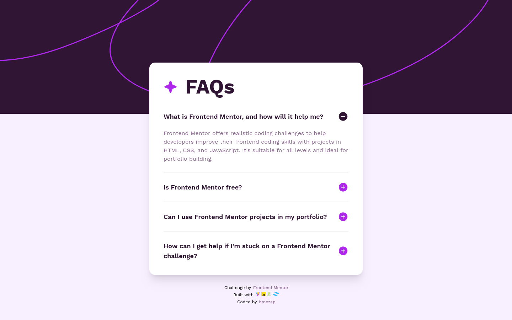
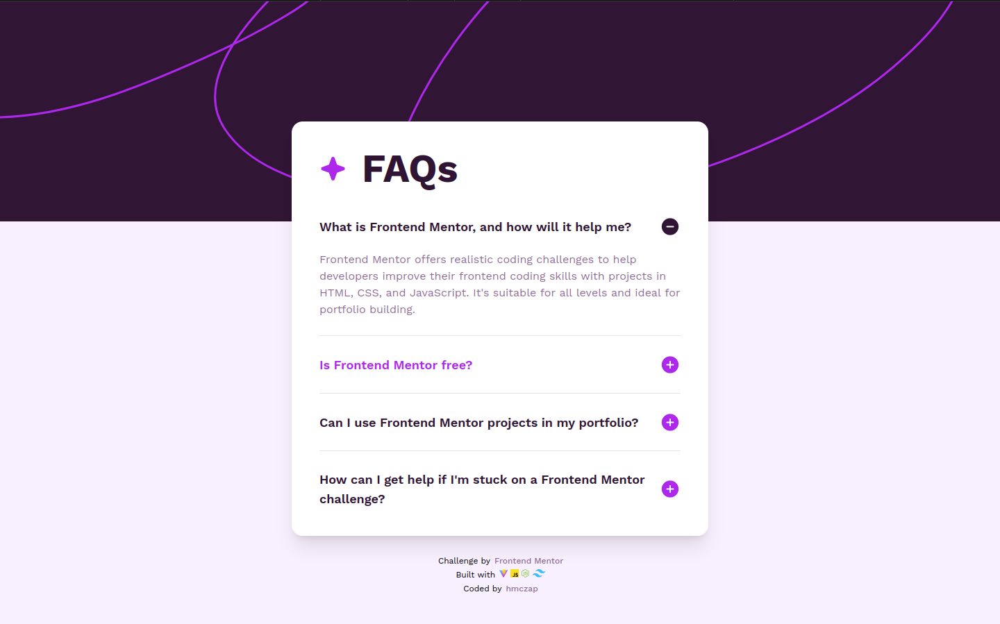
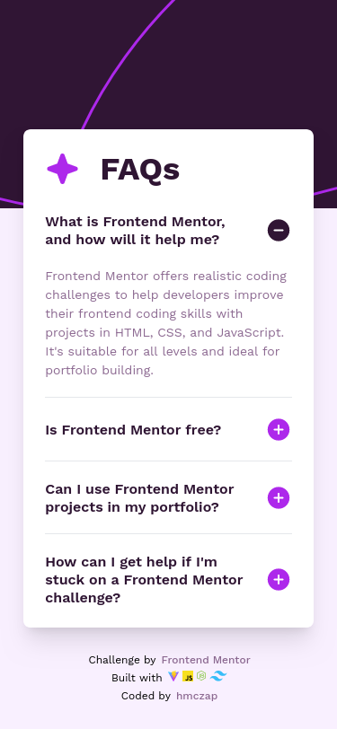

# FAQ Accordion

This is a solution to the [FAQ accordion challenge on Frontend Mentor](https://www.frontendmentor.io/challenges/faq-accordion-wyfFdeBwBz/hub).

## Table of contents

- [Overview](#overview)
  - [The challenge](#the-challenge)
  - [Screenshot](#screenshot)
  - [Links](#links)
- [My process](#my-process)
  - [Built with](#built-with)
- [Author](#author)
- [Acknowledgments](#acknowledgments)

## Overview

### The challenge

Users should be able to:

- See hover and focus states for all interactive elements on the page
- Expand and compress FAQ items to view answers
- Navigate the questions and hide/show answers using keyboard navigation alone
- View the optimal layout for the interface depending on their device's screen size

### Screenshot

### Links

- Solution URL: [here](https://github.com/hmczap/FAQ-Accordion)
- Live Site URL: [here](https://hmczap.github.io/FAQ-Accordion/)

## My process

### Built with

## Author

- Frontend Mentor - [@hmczap](https://www.frontendmentor.io/profile/hmczap)

## Acknowledgments

- [Skill-icons](https://github.com/tandpfun/skill-icons) - An awesome repo I used to add the skills icons above!
